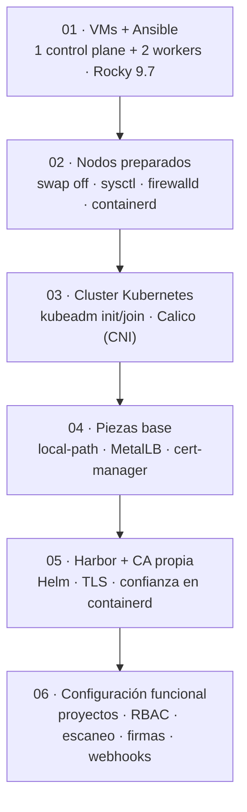

# Harbor sobre Kubernetes — Registry Seguro

## Descripción del proyecto

Este proyecto despliega **Harbor**, un registry de contenedores privado y seguro, sobre un **cluster de Kubernetes** construido desde cero con `kubeadm` en tres máquinas Rocky Linux 9.7, automatizado de punta a punta con **Ansible**. No es solo "instalar un registry": el objetivo es demostrar un flujo real de DevSecOps, donde cada imagen que entra al cluster pasa por controles concretos antes de poder ejecutarse.

¿Por qué importa esto? En cualquier organización que use contenedores, el registry es el punto de entrada de todo lo que termina corriendo en producción. Un registry sin control es una puerta abierta: cualquiera puede subir una imagen con vulnerabilidades conocidas, nadie sabe quién publicó qué, y no hay forma de saber si el contenido cambió después de publicarse. Este proyecto resuelve esos tres problemas con mecanismos verificables, no solo declarados:

- **Separación de entornos real**: tres proyectos (`desarrollo`, `staging`, `producción`) con políticas de seguridad distintas y crecientes.
- **Control de acceso por rol**: usuarios con permisos diferenciados por proyecto, y credenciales de máquina (*robot accounts*) de mínimo privilegio y vigencia limitada.
- **Escaneo automático de vulnerabilidades** con Trivy, con bloqueo real del *pull* de imágenes peligrosas, no solo una advertencia visual.
- **Firma de imágenes con Cosign**, para garantizar que lo que se descarga es exactamente lo que se publicó.
- **Trazabilidad**, con webhooks que notifican cada evento en tiempo real.

Todo el despliegue —desde preparar el sistema operativo hasta configurar las políticas de Harbor— es reproducible con los playbooks de este repositorio, y cada decisión de arquitectura está justificada en `docs/`.

## Arquitectura

El cluster se construye en seis capas, cada una dependiente de la anterior:



**Red:** los tres nodos viven en una red host-only (`192.168.56.0/24`). MetalLB reparte un rango propio de esa misma red (`192.168.56.200-210`) para exponer Harbor con una IP fija y accesible, sin depender de un proveedor de nube. La confianza TLS se resuelve con una **CA propia de laboratorio**, creada con cert-manager, distribuida a los tres nodos.


*(Sustituye esta imagen por tu propio diagrama o captura si quieres una versión adicional a la de arriba)*

## Prerrequisitos

| Requisito | Detalle |
|---|---|
| Máquinas | 3 VMs con Rocky Linux 9.7 (1 control plane + 2 workers), IP fija cada una |
| Recursos por VM | Mínimo 2 vCPU y 4 GB de RAM (el control plane necesita margen extra por Calico, MetalLB y cert-manager) |
| Red | Las tres VMs deben verse entre sí; un rango de IPs libre de al menos 10 direcciones para MetalLB |
| Acceso | Usuario con `sudo` y llave SSH configurada entre el nodo de control y los tres nodos |
| Máquina de control | `ansible-core` instalado, con las colecciones `ansible.posix` y `community.general` |
| Herramientas cliente | `podman`, `jq`, `cosign` (para las pruebas de push/pull y firma) |
| Internet en los nodos | Para descargar paquetes, imágenes y charts de Helm |

## Instalación

Todo se ejecuta como el usuario `ansible`, desde la carpeta `ansible/` del repositorio.

### 1. Preparar el acceso

```bash
ssh-keygen -t ed25519 -N "" -f ~/.ssh/id_ed25519
ssh-copy-id ansible@<ip-master>
ssh-copy-id ansible@<ip-worker01>
ssh-copy-id ansible@<ip-worker02>
```

### 2. Configurar el inventario

Edita `ansible/inventory.ini` con las IPs reales de tu laboratorio:

```ini
[control_plane]
master ansible_host=<ip-master>

[workers]
worker01 ansible_host=<ip-worker01>
worker02 ansible_host=<ip-worker02>

[k8s:children]
control_plane
workers

[all:vars]
ansible_user=ansible
ansible_python_interpreter=/usr/bin/python3
```

### 3. Cifrar las contraseñas de Harbor

```bash
cp group_vars/all/vault.yml.example group_vars/all/vault.yml
$EDITOR group_vars/all/vault.yml   # define harbor_admin_password y harbor_secret_key (16 caracteres exactos)
ansible-vault encrypt group_vars/all/vault.yml
```

### 4. Ejecutar los playbooks, en orden

```bash
ansible-galaxy collection install -r requirements.yml
ansible all -m ping

ansible-playbook 01-prepare-nodes.yml
ansible-playbook 02-k8s-cluster.yml
ansible-playbook 03-addons.yml
ansible-playbook 04-harbor.yml --ask-vault-pass
ansible-playbook 05-trust-registry.yml
ansible-playbook 06-harbor-config.yml --ask-vault-pass
```

Si tu profesor o entorno ya te entrega un cluster de Kubernetes funcionando, puedes omitir `01-prepare-nodes.yml` y `02-k8s-cluster.yml`.

## Configuración explicada

- **`group_vars/all/main.yml`**: variables públicas del proyecto — dominio de Harbor (`harbor_domain`), IP de MetalLB (`harbor_lb_ip`), rangos de red (`pod_cidr`, `service_cidr`, `node_cidr`), y versiones de cada componente. Ajusta aquí las versiones antes de instalar, verificándolas contra los repositorios oficiales.
- **`group_vars/all/vault.yml`** (cifrado): la contraseña de administrador de Harbor y la `secretKey` interna de 16 caracteres. Nunca se sube sin cifrar; se edita con `ansible-vault edit`.
- **`harbor-values.yaml`**: la configuración de Harbor para Helm — exposición como `LoadBalancer`, certificado TLS vía Secret, almacenamiento persistente con `local-path`, y límites de CPU/memoria por componente (`core`, `registry`, `database`, `trivy`, etc.), ajustados para correr en VMs de 4 GB.
- **`06-harbor-config.yml`**: la política de seguridad en sí — los tres proyectos con sus distintos niveles de exigencia (escaneo, bloqueo por severidad, firma obligatoria), los usuarios y sus roles, y los *robot accounts* de mínimo privilegio.

## Comandos de validación

```bash
# El cluster está sano
kubectl get nodes                          # los 3 nodos en Ready
kubectl get pods -A | grep -v Running       # no debería devolver nada relevante

# Harbor responde con TLS válido
curl -sI https://harbor.lab.local

# Los tres proyectos existen con sus políticas
curl -sk -u admin:<password> https://harbor.lab.local/api/v2.0/projects

# El bloqueo por vulnerabilidades funciona (debe fallar)
podman pull harbor.lab.local/staging/nginx:1.16

# El pod de prueba puede descargar desde producción usando el robot account
kubectl get pod test-harbor-pull   # debe mostrar Completed o Running
```

Para el detalle completo de cada problema encontrado durante la instalación y su solución paso a paso, consulta [`docs/troubleshooting.md`](docs/troubleshooting.md). Para la cobertura de controles ISO/IEC 27001, consulta `docs/iso27001.md`.
