# Guía de instalación — Harbor sobre Kubernetes

Instalación completa de un registry privado seguro (Harbor) sobre un cluster de Kubernetes construido con `kubeadm`, en Rocky Linux 9.7, automatizado con Ansible.

> 📸 Los espacios marcados como `` son donde debes insertar tus propias capturas de pantalla.

---

## Requisitos

### Hardware (por VM)

| Rol | Cantidad | RAM mínima | RAM recomendada | vCPU | Disco |
|---|---|---|---|---|---|
| Control plane (master) | 1 | 4 GB | 4.5 GB | 2 | 30 GB |
| Worker | 2 (3 para bonus HA) | 4 GB | 4 GB | 2 | 40 GB |
| Equipo físico anfitrión | — | 16 GB | 16 GB o más | 4+ | — |

> ⚠️ Con menos de 3.6 GB por nodo, el cluster puede sufrir `soft lockup` durante el arranque de Calico y MetalLB (ver `troubleshooting.md`, incidente #7).

### Software

| Software | Versión usada | Dónde se instala |
|---|---|---|
| Rocky Linux | 9.7 / 9.8 | Las 3 VMs |
| VirtualBox | Cualquiera reciente, con red host-only configurada | Equipo físico |
| Ansible | `ansible-core` (última disponible vía `dnf`) | Solo en el master |
| Kubernetes | v1.34.x | Los 3 nodos, vía `kubeadm` |
| containerd | `containerd.io` (repo de Docker CE) | Los 3 nodos |
| Calico | v3.30.x | Cluster (CNI) |
| Helm | v3.22.x | Solo en el master |
| Harbor (chart) | vigente en `helm.goharbor.io` | Cluster |
| cert-manager | vigente en `charts.jetstack.io` | Cluster |
| MetalLB | vigente en `metallb.github.io/metallb` | Cluster |

### Red

- Las 3 VMs en la misma red host-only de VirtualBox (ejemplo usado: `192.168.56.0/24`).
- Un rango de IPs libre dentro de esa red, reservado para MetalLB (ejemplo: `192.168.56.200-210`), que **no debe** coincidir con el rango DHCP de VirtualBox ni con las IPs de las VMs.
- Salida a internet desde las 3 VMs (para descargar paquetes, imágenes y charts).

### Tiempo total estimado

| Fase | Tiempo estimado |
|---|---|
| 1. VMs + Ansible | 20-30 min |
| 2. Preparar los nodos | 15-20 min |
| 3. Cluster de Kubernetes | 15-25 min |
| 4. Piezas base | 10-15 min |
| 5. Harbor + confianza en la CA | 15-20 min |
| 6. Configurar y probar | 30-40 min |
| **Total** | **≈ 2 a 2.5 horas**, sin contar tiempo de espera por incidentes de red o recursos |

---

## Fase 1 — VMs y Ansible

**Tiempo estimado: 20-30 minutos**

### 1.1 Crear las VMs

Crea 3 VMs en VirtualBox con Rocky Linux 9.7, cada una con un adaptador **host-only** (para que se vean entre sí) y opcionalmente un adaptador NAT (para salida a internet). Asígnales IPs fijas dentro de la red host-only.

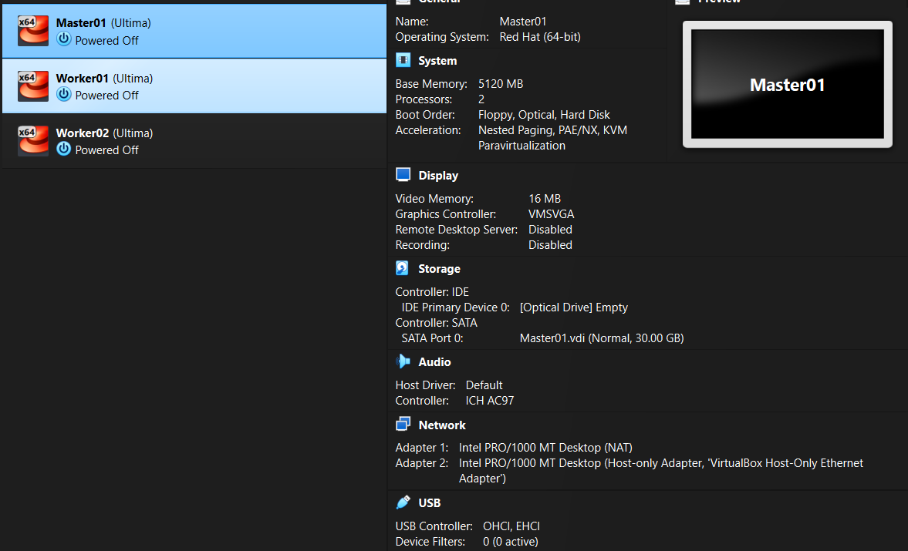

### 1.2 Instalar Ansible en el master

```bash
sudo dnf install -y ansible-core
ansible --version
```

**Qué hace:** instala `ansible-core`, la herramienta que va a ejecutar todas las tareas de configuración de forma remota y repetible sobre los tres nodos, sin necesidad de escribir cada comando a mano en cada VM.

**Salida esperada:**
```
ansible [core 2.14.x]
  config file = None
  ...
  python version = 3.9.x
```

### 1.3 Crear la llave SSH y distribuirla

```bash
ssh-keygen -t ed25519 -N "" -f ~/.ssh/id_ed25519
ssh-copy-id ansible@<IP_MASTER>
ssh-copy-id ansible@<IP_WORKER1>
ssh-copy-id ansible@<IP_WORKER2>
```

**Qué hace:** genera un par de llaves criptográficas (`-N ""` significa sin contraseña en la llave) y copia la llave pública a los tres nodos, incluido el propio master, porque Ansible se conecta a todos por SSH, sin excepción.

**Salida esperada** (por cada `ssh-copy-id`):
```
Number of key(s) added: 1
Now try logging into the machine...
```

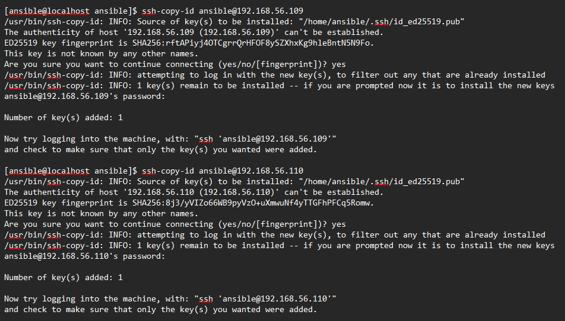

### 1.4 Crear el inventario y probar

```bash
mkdir -p ~/proyecto-harbor/ansible && cd ~/proyecto-harbor/ansible
```

Crea `ansible.cfg`, `inventory.ini` y `requirements.yml` (ver repositorio para el contenido exacto de cada uno). El inventario agrupa los nodos en `control_plane`, `workers`, y el grupo combinado `k8s`.

```bash
ansible-galaxy collection install -r requirements.yml
ansible all -m ping
```

**Qué hace:** `ansible-galaxy` instala las colecciones de módulos extra que usan los playbooks (`ansible.posix`, `community.general`). `ansible all -m ping` no es un ping de red: es una prueba completa de que Ansible puede conectarse por SSH, encontrar Python en el nodo remoto, y ejecutar un módulo.

**Salida esperada:**
```
worker01 | SUCCESS => { "changed": false, "ping": "pong" }
worker02 | SUCCESS => { "changed": false, "ping": "pong" }
master   | SUCCESS => { "changed": false, "ping": "pong" }
```

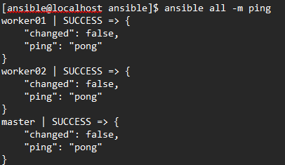

---

## Fase 2 — Preparar los nodos

**Tiempo estimado: 15-20 minutos**

Playbook: `01-prepare-nodes.yml`. Se aplica a los tres nodos (`hosts: k8s`).

### 2.1 Identidad y hora

- Pone el hostname de cada nodo igual al del inventario (`master`, `worker01`, `worker02`).
- Escribe en `/etc/hosts` de los tres nodos la lista de todos, más el dominio de Harbor.
- Instala y activa `chronyd`, para mantener los relojes sincronizados (necesario para que los certificados TLS no fallen por desfase horario).

### 2.2 Kernel

```bash
swapoff -a
```
**Qué hace:** desactiva la memoria de intercambio de inmediato. Kubernetes no arranca con swap activo, porque reparte memoria con límites exactos por pod y el swap los vuelve impredecibles. También se comenta la línea de swap en `/etc/fstab` para que no vuelva a activarse en un reinicio.

Se cargan los módulos de kernel `overlay` (usado por containerd para las capas de imágenes) y `br_netfilter` (permite que el firewall del kernel vea el tráfico entre pods), y se configuran los parámetros `sysctl` que habilitan el reenvío de paquetes IP.

### 2.3 SELinux y firewall

SELinux se deja en modo `permissive` (documentado como decisión consciente, ver `iso27001.md`). Firewalld se mantiene **activo**, abriendo solo los puertos que Kubernetes, Calico y MetalLB necesitan — no se desactiva.

**Puertos abiertos en todos los nodos:** `10250/tcp` (kubelet), `10256/tcp` (kube-proxy), `30000-32767/tcp` (NodePorts), `179/tcp` y `4789/udp` (Calico), `7946/tcp+udp` (MetalLB), `80/443/tcp` (Harbor).
**Puertos adicionales solo en el master:** `6443/tcp` (API server), `2379-2380/tcp` (etcd), `10257/tcp` y `10259/tcp` (controller-manager, scheduler).

### 2.4 containerd y Kubernetes

```bash
sudo dnf install -y containerd.io
containerd config default > /etc/containerd/config.toml
```
**Qué hace:** instala el runtime de contenedores. El archivo de configuración por defecto se genera una sola vez (Ansible usa un archivo marcador para no repetirlo). Después se ajustan dos valores críticos: `SystemdCgroup = true` (para que containerd y kubelet usen el mismo sistema de control de recursos) y `config_path` apuntando a `/etc/containerd/certs.d` (preparación para la confianza en la CA de Harbor, fase 5).

```bash
sudo dnf install -y kubelet kubeadm kubectl
```
**Qué hace:** instala el agente de nodo (`kubelet`), la herramienta de creación de cluster (`kubeadm`) y el cliente de administración (`kubectl`), desde el repositorio oficial de Kubernetes.

**Ejecutar el playbook completo:**

```bash
ansible-playbook 01-prepare-nodes.yml
```

**Salida esperada** (resumen final):
```
PLAY RECAP
master   : ok=28  changed=X  unreachable=0  failed=0
worker01 : ok=27  changed=X  unreachable=0  failed=0
worker02 : ok=27  changed=X  unreachable=0  failed=0
```

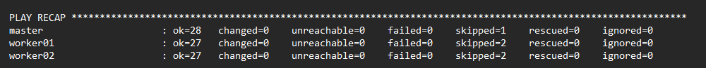

> ✅ **Verificación de idempotencia:** ejecuta el mismo comando una segunda vez. Debe salir `changed=0`, confirmando que Ansible no repite trabajo ya hecho.

---

## Fase 3 — Cluster de Kubernetes

**Tiempo estimado: 15-25 minutos**

Playbook: `02-k8s-cluster.yml`.

### 3.1 Inicializar el control plane

```bash
kubeadm init --apiserver-advertise-address=<IP_MASTER> --pod-network-cidr=10.244.0.0/16
```

**Qué hace:** arranca los componentes del control plane (API server, etcd, scheduler, controller-manager) como contenedores estáticos, genera los certificados internos del cluster, y reserva el rango de red `10.244.0.0/16` para los pods. La bandera `--apiserver-advertise-address` evita que Kubernetes elija automáticamente la IP equivocada en un entorno con varios adaptadores de red.

**Tiempo:** 1-2 minutos.

### 3.2 Instalar Calico (CNI)

```bash
kubectl apply --server-side -f https://raw.githubusercontent.com/projectcalico/calico/<version>/manifests/tigera-operator.yaml
```
**Qué hace:** instala el operador de Calico, que a su vez despliega el resto de componentes de red.

```bash
kubectl apply -f custom-resources.yaml   # con pod_cidr ajustado a 10.244.0.0/16
```
**Qué hace:** aplica la configuración que le dice al operador qué red de pods usar — debe coincidir exactamente con el `--pod-network-cidr` del paso anterior.

**Sin esta capa, el nodo se queda `NotReady` para siempre**: es el estado esperado hasta este punto.

### 3.3 Unir los workers

```bash
kubeadm token create --print-join-command
```
**Qué hace:** genera un token temporal de unión (expira en 24 horas por defecto). El comando completo que devuelve se ejecuta en cada worker:

```bash
kubeadm join <IP_MASTER>:6443 --token <token> --discovery-token-ca-cert-hash sha256:<hash>
```

**Ejecutar el playbook completo:**

```bash
ansible-playbook 02-k8s-cluster.yml
```

**Salida esperada** (estado final de los nodos):
```
NAME       STATUS   ROLES           VERSION
master     Ready    control-plane   v1.34.11
worker01   Ready    <none>          v1.34.11
worker02   Ready    <none>          v1.34.11
```

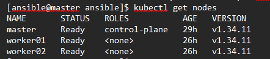

**Tiempo:** 10-15 minutos (Calico y kube-proxy tardan en descargarse e iniciar en cada worker).

---

## Fase 4 — Piezas base

**Tiempo estimado: 10-15 minutos**

Playbook: `03-addons.yml`.

### 4.1 Helm y almacenamiento

```bash
curl -fsSL https://raw.githubusercontent.com/helm/helm/main/scripts/get-helm-3 | bash
```
**Qué hace:** instala Helm, el gestor de paquetes de Kubernetes con el que se instalarán MetalLB, cert-manager y Harbor.

```bash
kubectl apply -f https://raw.githubusercontent.com/rancher/local-path-provisioner/<version>/deploy/local-path-storage.yaml
kubectl patch storageclass local-path -p '{"metadata":{"annotations":{"storageclass.kubernetes.io/is-default-class":"true"}}}'
```
**Qué hace:** instala un aprovisionador de almacenamiento simple, que crea volúmenes en el disco del nodo donde corre cada pod, y lo marca como predeterminado, para que Harbor lo use automáticamente sin tener que nombrarlo.

### 4.2 MetalLB

```bash
helm upgrade --install metallb metallb/metallb -n metallb-system --create-namespace --wait --timeout 5m
```
**Qué hace:** instala MetalLB, que le da a Kubernetes la capacidad de asignar IPs externas reales a los Services tipo `LoadBalancer` — algo que un cluster fuera de una nube no tiene por defecto.

```yaml
apiVersion: metallb.io/v1beta1
kind: IPAddressPool
spec:
  addresses:
    - 192.168.56.200-192.168.56.210
```
**Qué hace:** define el rango de IPs que MetalLB puede repartir, y un `L2Advertisement` que le dice que las anuncie por ARP en la red local.

### 4.3 cert-manager

```bash
helm upgrade --install cert-manager jetstack/cert-manager -n cert-manager --create-namespace --set crds.enabled=true --wait --timeout 5m
```
**Qué hace:** instala el componente que gestionará los certificados TLS de Harbor: los crea, los renueva automáticamente antes de que expiren, y expone los tipos `Certificate`/`ClusterIssuer` que se usan en la fase 5.

**Ejecutar el playbook completo:**

```bash
ansible-playbook 03-addons.yml
```

**Salida esperada:**
```
NAME                                       READY   STATUS
metallb-controller-...                     1/1     Running
metallb-speaker-... (x3)                   1/1     Running
cert-manager-...                           1/1     Running
cert-manager-cainjector-...                1/1     Running
cert-manager-webhook-...                   1/1     Running
```

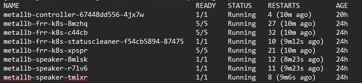

---

## Fase 5 — Harbor y confianza en la CA

**Tiempo estimado: 15-20 minutos**

Playbook: `04-harbor.yml`.

### 5.1 Construir la cadena de confianza TLS

```yaml
# ClusterIssuer autofirmado → Certificate (CA del laboratorio) → ClusterIssuer (la CA) → Certificate (harbor-tls)
```
**Qué hace:** en tres pasos, cert-manager crea una CA propia de laboratorio (válida 5 años) y la usa para firmar un certificado para `harbor.lab.local` (válido 90 días, renovación automática). Esto reemplaza a una CA pública, que no existe en un laboratorio cerrado.

```bash
kubectl -n cert-manager wait --for=condition=Ready certificate/lab-ca --timeout=120s
kubectl -n harbor wait --for=condition=Ready certificate/harbor-tls --timeout=120s
```
**Qué hace:** espera de forma explícita a que ambos certificados terminen de generarse antes de continuar, ya que cert-manager trabaja de forma asíncrona.

### 5.2 Secretos de Harbor

```bash
kubectl -n harbor create secret generic harbor-admin --from-literal=HARBOR_ADMIN_PASSWORD='...'
kubectl -n harbor create secret generic harbor-secretkey --from-literal=secretKey='...'
```
**Qué hace:** crea los secretos que Harbor usará como contraseña de administrador y clave interna de cifrado (exactamente 16 caracteres), en vez de escribirlos en texto plano en el archivo de configuración. Los valores reales viven cifrados en `ansible-vault`.

### 5.3 Instalar Harbor con Helm

```bash
helm upgrade --install harbor harbor/harbor -n harbor -f harbor-values.yaml --wait --timeout 15m
```
**Qué hace:** instala Harbor completo (core, portal, jobservice, registry, base de datos, redis, Trivy) usando un `values.yaml` propio que define: exposición como `LoadBalancer`, TLS desde el Secret `harbor-tls`, almacenamiento persistente vía `local-path`, y límites explícitos de CPU/memoria por componente.

**Tiempo:** 5-10 minutos, dependiendo de la velocidad de descarga de las imágenes.

**Salida esperada:**
```
NAME                                READY   STATUS
harbor-core-...                     1/1     Running
harbor-database-0                   1/1     Running
harbor-jobservice-...                1/1     Running
harbor-nginx-...                    1/1     Running
harbor-portal-...                   1/1     Running
harbor-redis-0                      1/1     Running
harbor-registry-...                 2/2     Running
harbor-trivy-0                      1/1     Running
```

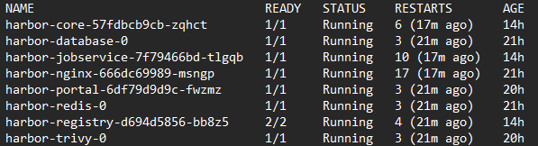

```bash
kubectl -n harbor get svc harbor
```
```
NAME     TYPE           EXTERNAL-IP      PORT(S)
harbor   LoadBalancer   192.168.56.200   80:xxxxx/TCP,443:xxxxx/TCP
```

### 5.4 Distribuir la CA a los tres nodos

```bash
kubectl -n cert-manager get secret lab-ca-secret -o jsonpath='{.data.ca\.crt}' | base64 -d
```
**Qué hace:** extrae el certificado público de la CA (no la llave privada) desde el Secret donde cert-manager lo guardó.

En cada nodo:
```
/etc/containerd/certs.d/harbor.lab.local/
  ├── ca.crt
  └── hosts.toml
```
**Qué hace:** le indica a containerd, dominio por dominio, en qué certificado confiar al conectarse a Harbor. Sin esto, cada `pull` de un pod fallaría con `x509: certificate signed by unknown authority`. La misma CA se agrega también al almacén de confianza del sistema operativo (`update-ca-trust`), para que `curl` y `podman` también confíen en ella.

### 5.5 Verificación desde el navegador

Añade en tu equipo físico (archivo `hosts` del sistema operativo):
```
192.168.56.200 harbor.lab.local
```

Abre `https://harbor.lab.local`. El navegador advertirá que el certificado no es de una CA pública conocida — es el comportamiento esperado con una CA propia de laboratorio.

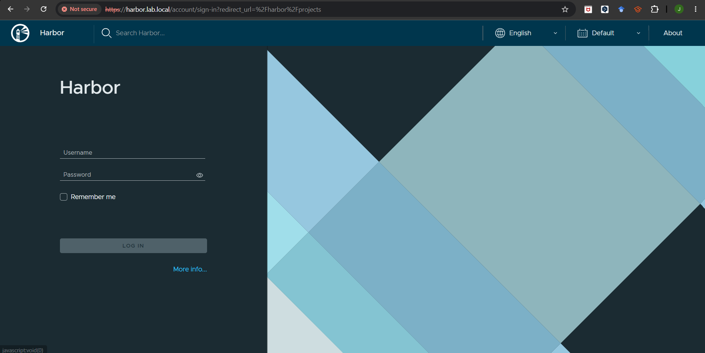

---

## Fase 6 — Configurar y probar

**Tiempo estimado: 30-40 minutos**

Playbook: `06-harbor-config.yml`, más pasos manuales con `podman` y en la interfaz web.

### 6.1 Proyectos

```bash
# API POST /api/v2.0/projects, con metadata distinta por proyecto
```

| Proyecto | `auto_scan` | `prevent_vul` | `severity` |
|---|---|---|---|
| desarrollo | true | false | — |
| staging | true | true | high |
| producción | true | true | high |

**Qué hace:** crea los tres entornos con distinto nivel de exigencia, vía la API de Harbor, usando autenticación básica con el usuario `admin`.

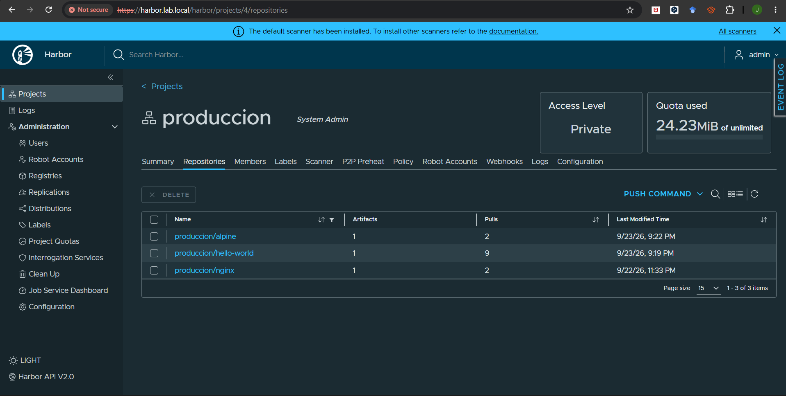

### 6.2 Usuarios y roles

```bash
# API POST /api/v2.0/users
# API POST /api/v2.0/projects/{proyecto}/members  (role_id: 2=Developer, 3=Guest, 4=Maintainer)
```

**Qué hace:** crea tres usuarios (`dev1`, `ops1`, `auditor1`) y les asigna roles distintos en cada proyecto, según la matriz de acceso definida (ver `iso27001.md`).

### 6.3 Robot accounts

```bash
# API POST /api/v2.0/robots
```

**Qué hace:** crea dos credenciales de máquina con permisos mínimos: `ci-push` (push+pull en desarrollo) y `k8s-pull` (solo pull en producción), ambas con 30 días de vigencia. El token se devuelve una sola vez y se guarda localmente con permisos restringidos (`chmod 600`).

### 6.4 Escaneo automático y bloqueo por severidad

```bash
podman pull docker.io/library/nginx:1.16
podman tag docker.io/library/nginx:1.16 harbor.lab.local/staging/nginx:1.16
podman push harbor.lab.local/staging/nginx:1.16
```
**Qué hace:** sube una imagen con vulnerabilidades conocidas a `staging`. El push se acepta; el escaneo de Trivy se dispara solo.

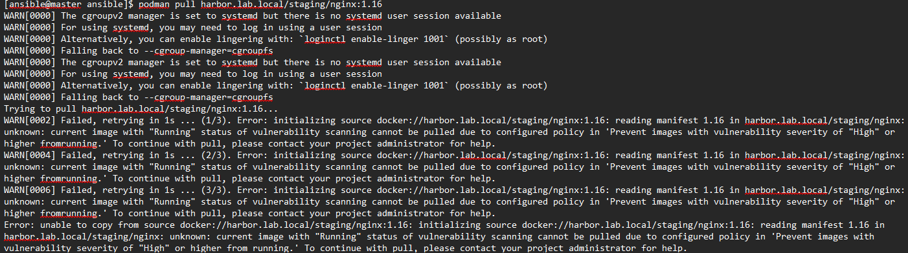

```bash
podman login harbor.lab.local -u dev1
podman pull harbor.lab.local/staging/nginx:1.16
```
**Salida esperada** (bloqueo):
```
Error: ... current image with "Running" status of vulnerability scanning cannot be
pulled due to configured policy in 'Prevent images with vulnerability severity of
"High" or higher from running.'
```


### 6.5 Firmas con Cosign

```bash
cosign generate-key-pair
cosign sign --key cosign.key harbor.lab.local/produccion/hello-world:latest
cosign verify --key cosign.pub harbor.lab.local/produccion/hello-world:latest
```
**Qué hace:** genera un par de llaves, firma una imagen en producción, y verifica la firma. Después se activa `enable_content_trust_cosign` en el proyecto, exigiendo firma para cualquier pull.

**Salida esperada al intentar bajar una imagen sin firmar:**
```
Error: ... The image is not signed by cosign.
```

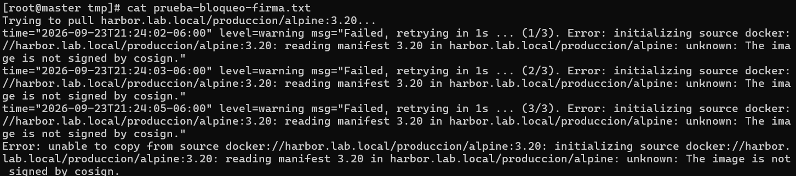

### 6.6 Kubernetes consumiendo de Harbor

```bash
kubectl create secret docker-registry harbor-pull-secret \
  --docker-server=harbor.lab.local \
  --docker-username='robot$produccion+k8s-pull' \
  --docker-password='<token>' -n default
```
**Qué hace:** crea un Secret de tipo especial que Kubernetes usa automáticamente para autenticarse contra un registry privado al descargar una imagen.

```yaml
spec:
  imagePullSecrets:
    - name: harbor-pull-secret
  containers:
    - image: harbor.lab.local/produccion/hello-world:latest
```

**Salida esperada:**
```
NAME               READY   STATUS      AGE
test-harbor-pull   0/1     Completed   93s
```

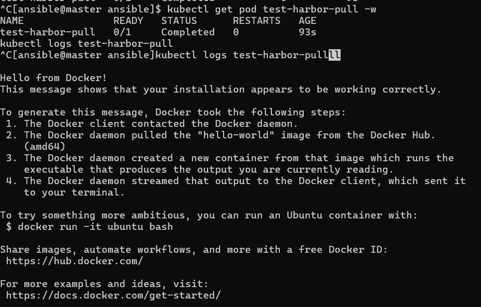

### 6.7 Retención, inmutabilidad y webhooks (interfaz web)

- **Tag Retention** (Projects → producción → Policy → Tag Retention): retiene los 10 artefactos más recientes por repositorio.
- **Tag Immutability** (misma pestaña, sub-sección Tag Immutability): todos los tags en producción quedan protegidos contra sobrescritura.
- **Webhooks** (Projects → producción → Webhooks): notificación HTTP a un endpoint externo en cada push o escaneo.

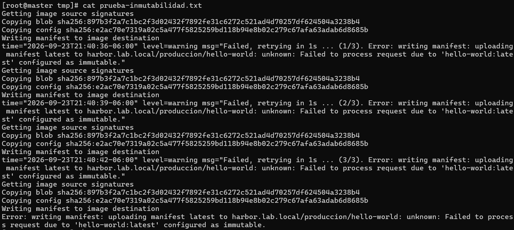
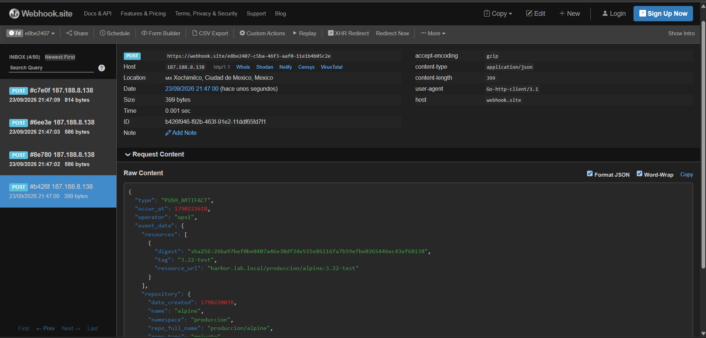

---

## Checklist final de verificación

- [ ] `kubectl get nodes` muestra los 3 nodos en `Ready`
- [ ] `kubectl -n harbor get pods` muestra todos los pods en `Running`
- [ ] `https://harbor.lab.local` carga con el certificado de la CA propia
- [ ] Login como `admin` funciona
- [ ] Los tres proyectos existen con sus políticas correctas
- [ ] Pull de imagen vulnerable en `staging` es rechazado
- [ ] Pull de imagen sin firmar en `producción` es rechazado
- [ ] Pod de prueba en Kubernetes queda en `Completed`/`Running` usando el robot account
- [ ] El webhook recibe notificaciones en tiempo real

Para el registro completo de errores encontrados durante esta instalación y cómo se resolvieron, ver `docs/troubleshooting.md`.
